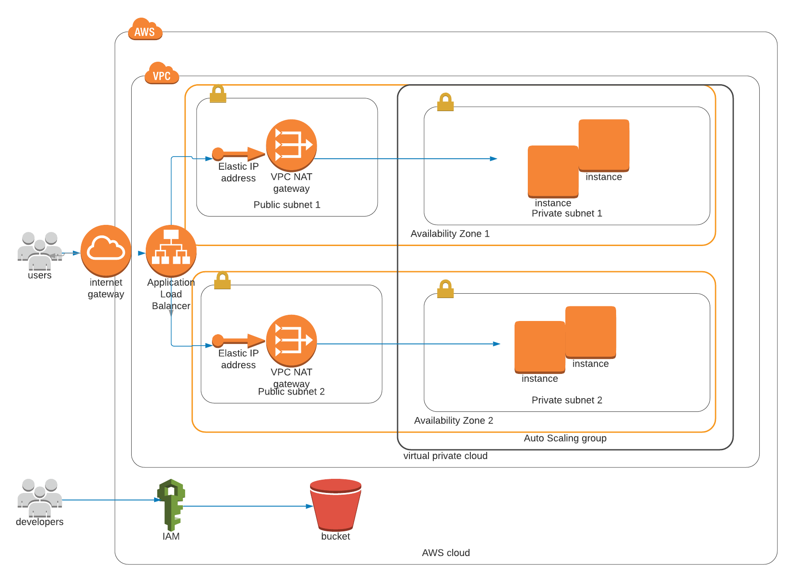

# aws-cloudformation-deploy

***aws-cloudformation-deploy*** script allows deploying a High-Availability Web App using CloudFormation.

This is the load balancer url:

http://myser-loadb-1q5pimb3rxh5x-1184854684.us-west-2.elb.amazonaws.com/

And this is the result I obtained.


 ***Credits***
Udacity Cloud DevOps Nanodegree Program

To propose this code I inspired myself in the code the teacher provided and other references as aws templates and shell script templates (from the aws official [documentation](https://aws.amazon.com/cloudformation/resources/templates/)) to automate the update and creation of stacks.

## 1. Get Started
### a. Requirements. 
#### I. Specs
#### II. Rubric
### b. System architecture
### c. Steps
## 2. Usage
## 3. Contributing

------------------

## 1. Get Started

A system architecture is first identified from the requreiments and then written into an script.


### a. Requirements. 

#### I. Specs

- [x] Server specs


You'll need to create a Launch Configuration for your application servers in order to deploy four servers, two located in each of your private subnets. The launch configuration will be used by an auto-scaling group.

You'll need two vCPUs and at least 4GB of RAM. The Operating System to be used is Ubuntu 18. So, choose an Instance size and Machine Image (AMI) that best fits this spec. Be sure to allocate at least 10GB of disk space so that you don't run into issues. 

- [x] Security Groups and Roles


Since you will be downloading the application archive from an S3 Bucket, you'll need to create an IAM Role that allows your instances to use the S3 Service.

Udagram communicates on the default HTTP Port: 80, so your servers will need this inbound port open since you will use it with the Load Balancer and the Load Balancer Health Check. As for outbound, the servers will need unrestricted internet access to be able to download and update its software.

The load balancer should allow all public traffic (0.0.0.0/0) on port 80 inbound, which is the default HTTP port. Outbound, it will only be using port 80 to reach the internal servers.

The application needs to be deployed into private subnets with a Load Balancer located in a public subnet.

One of the output exports of the CloudFormation script should be the public URL of the LoadBalancer.

Bonus points if you add http:// in front of the load balancer DNS Name in the output, for convenience.

- [x] Other Considerations


You can deploy your servers with an SSH Key into Public subnets while you are creating the script. This helps with troubleshooting. Once done, move them to your private subnets and remove the SSH Key from your Launch Configuration.

It also helps to test directly, without the load balancer. Once you are confident that your server is behaving correctly, increase the instance count and add the load balancer to your script.

While your instances are in public subnets, you'll also need the SSH port open (port 22) for your access, in case you need to troubleshoot your instances.

Log information for UserData scripts is located in this file: cloud-init-output.log under the folder: /var/log.

You should be able to destroy the entire infrastructure and build it back up without any manual steps required, other than running the CloudFormation script.

The provided UserData script should help you install all the required dependencies. Bear in mind that this process takes several minutes to complete. Also, the application takes a few seconds to load. This information is crucial for the settings of your load balancer health check.

It's up to you to decide which values should be parameters and which you will hard-code in your script.

See the provided supporting code for help and more clues.

If you want to go the extra mile, set up a bastion host to allow you to SSH into your private subnet servers. This bastion host would be on a Public Subnet with port 22 open only to your home IP address, and it would need to have the private key that you use to access the other servers.

Last thing: Remember to delete your CloudFormation stack when you're done to avoid recurring charges!

#### II. Rubric


The basics

- [x] ***Parameters***: The more the better, but an exaggerated number of parameters can be messy ( say, 10 or more ). 1 or 0 is definitely lacking.
- [x] ***Resources***: This is the mandatory section of the script, we are looking for a LoadBalancer, Launch Configuration, AutoScaling group a health check, security groups and a Listener and Target Group.
- [x] ***Outputs***: This is optional, but it would be nice to have a URL here with the Load Balancer DNS Name and “http” in front of it .
- [x] ***Working test***: If the student provides a URL to verify his work is running properly, it will be a page that says “it works! Udagram, Udacity”

Load Balancer

-[x] ***Target Group***: The auto-scaling group needs to have a property that associates it with a target group. The Load Balancer will have a Listener rule associated with the same target group
-[x] ***Health Check and Listener***: Port 80 should be used in Security groups, health checks and listeners associated with the load balancer

Auto-Scaling

-[x] ***Subnets***: Students should be using PRIV-NET ( private subnets ) for their auto-scaling instances
-[x] ***Machine Specs***: The machine should have 10 GB or more of disk and should be a t3.small or better.
-[x] ***SSH Key***: There shouldn’t be a ‘keyname’ property in the launch config

Bonus

-[x] ***Output***: Any values in the output section are a bonus
-[x] ***Bastion Host***: Any resource of type AWS::EC2::Instance, optional, but nice to have.

### b. System architecture



### c. Steps

1. Set up aws cli and user
    1. Create an user for testing this deployment
    2. Install aws cli, and run in powershell in this folder "aws --version"
    3. aws configure, with secret key of the user created
    4. aws s3 ls, to check setup
2. Write an .sh that run the yml. I inspired from [this](!https://gist.github.com/mdjnewman/b9d722188f4f9c6bb277a37619665e77) 
3. Try running an easy cloud formation stack
    Just an ec2 and run the code: check that it runs properly
4. Do teh server specs
    Create a network
    Create an autoscaling group. And check accesibility.
    As the autoscaling group alone does not work, it is looked for a designer instance.
5. Do teh security groups and roles
6. Do the other considerations

THen I realize, there is a lot of compelxity and that it is better automating atesting system for it.

## 2. Usage

This shell script deploy the system architecture described

```bash
./deploy.sh networkstack network_config.yml nw_param.json
./deploy.sh serversstack servers_config.yml servers_param.json
```

Debugging:

```bash
bash -x ./deploy.sh networkstack network_config.yml nw_param.json
bash -x ./deploy.sh serversstack servers_config.yml servers_param.json
```

## 3. Contributing

Pull requests are welcome. For major changes, please open an issue first to discuss what you would like to change.

Please make sure to update tests as appropriate.


